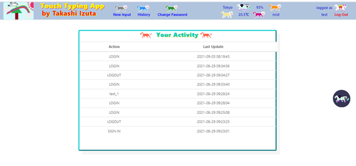

# :cat2: TOUCH TYPING APP FOR USE IN SCHOOLS  

## :boy: TAKASHI IZUTA

### :film_strip: Video Demo:  <URL HERE>

## :point_right:  Goal, Motivation and Uniqueness  
 
 このプロジェクトの目的は、学校で使用するための柔軟で適切なタッチタイピング練習用アプリを実装することです。

このプロジェクトの背景には、以下のような事実があります。

ほとんどの類似システムは、最初からサンプルテキストが埋め込まれており、システム管理者が変更やカスタマイズをすることができません。

一般的に、このようなシステムでは、学生の作業進捗レポートやアクティビティログを視覚化する比較的簡単な手段が用意されていないため、課題の評価や採点の作業負荷が高くなってしまいます。

そこで、この作品では、これらのギャップを埋めるために、講師が設定した目標や学生の特定のニーズに応じて学生のタッチタイピングスキルを訓練することを目的とした、柔軟でカスタマイズ可能なシンプルで使いやすいアプリを提供します。

このアプリには、他にも2つの特徴があります。

講師が提示したサンプルテキストは、別のブラウザウィンドウに表示され、ユーザーが見やすい場所に配置することができます。

日本語に対応した標準的なASCIIキーボードの配列が表示され、ユーザーが押しているキーが表示されます。これにより、学習者は自分の指や実際のキーボードを見ずに、指の位置を確認しながらタイピング作業を行うことができます。そうしないと、指を見るという不健康で好ましくない習慣を無意識のうちに身につけてしまうだけでなく、将来的には、タイピングの際にそれに大きく依存してしまう可能性があるからです。

また、アイコンやボタンなどのデザインは他人の素材に頼らず、作者自身が独自に作成したものです。

 The aim of this project is to implement a flexible and suitable touch typing practicing app for use in schools. 

 This work is motivated by the facts that 
 
 1. most available similar systems are, from the very beginning, embedded with sample texts that can not be changed or customized by the system administrator; 
 
 2. in general no relatively simple means to visualize the students work progress reports and activity logs are available in such systems, which increases the work load of assessing and grading the assignments.

 So, this work fills these gaps and provides a somehow flexible, customizable, simple and easy-to-use app to be used in classes aimed to train students in touch typing skills according to the goals set by the instructor or meeting some specific needs of the students.   

 There are two other striking characteristics that make this app very unique. 

  - The sample text given by the instructor is shown in a different detached browser window, so that the user can place it wherever it is more convenient to see it. 

  - There is a visual representation of a Japanese compatible standard ASCII keyboard layout on which the key being pressed by the user is shown. This allows learners to check their fingers' positions and perform the typewriting tasks without looking at their fingers and the actual keyboard. It is noteworthing that this feature is very important for practing touch typing, otherwise it is most likely that not only will the users uncounsciously acquire the unhealthy and undesirable habit of looking at the fingers but also and, in the future, perhaps even rely heavily on it when typewriting.

 In addition, icons, buttons and other designing resources were originally created by the author himself without relying on others' materials.

 All in all, the outcome of this work is a very useful and practical app that can be used in a pre-entry level information literacy course whose goal is to train learners in the typewriting skill. 

 It might sound naive or even exaggerated, but since, in general, any IT related activity starts on a keyboard or some similar devices and end up relying on the user's typewriting skills, the potential contribution of this app is, so to speak, incomputable!  

## :point_right: Basic Specification 
 
 このアプリは、flaskベースのウェブサーバ上で動作するpython、JavaScript、sqlite3、html、cssで実装されています。

このアプリは、標準的なディスプレイデバイスを装備したデスクトップまたはラップトップコンピュータで使用するように設計されています。スマートフォンなどのモバイル端末での使用は推奨されていません。

このアプリは、ユーザーのブラウザのジオロケーションに関連する天気情報をタイトルバーに表示します。この情報は、事前にAPI KEYを取得することで、外部のWebサービスopenweathermapから取得しています。さらに、ユーザーがシステムに登録またはログインする際にジオロケーションを取得します。

また、ウィンドウの右側に表示されるアイコンをクリックすると、ダークウィンドウの機能も利用できます。これは、フリーソフトウェアライセンスjsdelivrの一部であり、JavaScriptのコードによってアクセスされます。

 The app was implemented with python, JavaScript, sqlite3, html and css running on a flask based web server.

 It is designed to be used on a desktop or laptop computer equipped with a standard display device. It is not recommeded to be used on mobile smartphones and alike.

 The app displays the weather information related to the user browser's geolocation on the title bar. This information is resquested from an external web service [openweathermap](https://openweathermap.org/) through previous acquisition of an API KEY. Moreover, the geolocation is obtained by a JavaScript snippet when the user registers or logs in into the system.

 There is also a dark window functionality available through clicking on the icon displayed on the right side of the window. It is part of a free software license [jsdelivr](https://cdn.jsdelivr.net/) and is accessed by a piece of JavaScript code.  

## :point_right:  System Structure 

### :smile_cat: Preliminaries
 
 始める前に、openweathermap で API キーを取得し、「application.py」の 39 行目で変数 WEATHER_API を設定することをお勧めします。

テキストの数を変更したい場合は、「application.py」の44行目でNUMBER_OF_TEXTSのデフォルト値を変更すればOKです。しかし、ここで変更すると、'index.html'も少し変更しなければなりません。そのためには、'index.html'を開いて、指示に従ってください。

データベースファイルと管理者のユーザー名を変更したい場合は、システムを初期状態に戻す必要があります（「application.py」のADMIN_USER_NAMEとDB_NAMEという変数で定義されています）

つまり、システム・フォルダーにある「admin_folder」、「users_folder」、「touch_typing.db」というフォルダーを完全に削除します。

注意していただきたいのは、システムフォルダを削除してしまうと、サンプルファイルやタイプライター作業中のファイルがすべて削除されてしまうことです。そのため、システム導入時の一番最初、まだユーザーが登録されていない状態で行うようにしてください。さらに言えば、自己責任で行ってください。

 Before you begin, it is suggested that you get an API key at [openweathermap](https://openweathermap.org/) and set the variable WEATHER_API in 'application.py' at line 39. 
 
 Note that it is fine if no API key is set. The only difference is that, without it, the weather info on the title bar of the app will show only headlines.   

 If you want to change the number of texts, just reset the default value of NUMBER_OF_TEXTS in 'application.py' at line 44. However if you change it here you will also have to change 'index.html' a bit. To do so, just open 'index.html' and follow the directions.

 If you want to rename the database file and administrator's user name, which are defined by variables ADMIN_USER_NAME and DB_NAME, respectively  in 'application.py', you have to set back the system to its initial condition. 
 
 That is to say, delete entirely the folders 'admin_folder', 'users_folder' and 'touch_typing.db' on your system folder.

 Be aware, if you delete the system folders, all your sample files and undergoing typewriting task files will be deleted. So, do it only at the very beginning of system introduction without any user already signed up. :warning: More importantly, do it at your own risk and on your sole responsability.

### :smile_cat: Running Up
 
 システムをセットアップしたら、コンソールウィンドウを開き、「application.py」が格納されているディレクトリに移動します。そして、コンソールで「flask run」と入力して起動します。

システムを起動した直後に、'application.py'の上部にあるpythonコードの断片が実行されます。

まず、データベースファイルが存在しなければ作成します。次に、テーブル'users'、'user_input'、'history'が存在しない場合は作成されます。

テーブル'users'は、ユーザーの情報を保存するために使用され、以下の構造を持っています。

*id: integer primary key autoincrement
*user_name: TEXT NOT NULL
*user_password: TEXT NOT NULL
*register_date DEFAULT CURRENT_TIMESTAMP NOT NULL
*user_inputテーブルは、ユーザーの作業の現在の状態を保存するために使用されます。

そのフィールドは
*id integer primary key autoincrement
*user_id: integer not null
*user_name: TEXT NOT NULL
*input_file_name: TEXT NOT NULL
*input_done: NUMERIC NOT NULL
*input_match: NUMERIC NOT NULL
*last_update: DEFAULT CURRENT_TIMESTAMP NOT NULL
*historyテーブルは、システム上のアクティビティが格納されています。

そのフィールドは
*id: integer primary key
*user_id:  INTEGER NOT NULL
*activity: TEXT NOT NULL
*last_update DEFAULT CURRENT_TIMESTAMP NOT NULL
次に、管理者がテーブルに存在しない場合は、挿入します。

最後に、「admin_folder」と「users_folders」というフォルダが存在するかどうかを確認します。存在しない場合は、それらを作成し、その中に管理者のフォルダを作成します。また、「admin_folder/admin」フォルダの中にサンプルファイルを、「users_folder/admin」の中にタイプライターのタスクファイルを作成します。
 
 Once you set up your system, open a console window and move to the directory where 'application.py' is stored. Then start up by typing 'flask run' on your console.
 
 Immediately after you run up the system, the pieces of python codes in the upper part of 'application.py' are executed.
 
  Firstly, they create the database file if it does not exist. Then, tables 'users', 'user_input' and 'history' are created in case they do not exist.
  
  Table 'users' is used to store users' info and it has the following structure:
  
  - id: INTEGER PRIMARY KEY AUTOINCREMENT
  - user_name: TEXT NOT NULL
  - user_password: TEXT NOT NULL
  - register_date DEFAULT CURRENT_TIMESTAMP NOT NULL
  
 Table 'user_input' is used to store users' current status of the typewriting tasks. Its fields are
 
  - id: INTEGER PRIMARY KEY AUTOINCREMENT
  - user_id: INTEGER NOT NULL
  - user_name: TEXT NOT NULL
  - input_file_name: TEXT NOT NULL
  - input_done: NUMERIC NOT NULL
  - input_match: NUMERIC NOT NULL
  - last_update: DEFAULT CURRENT_TIMESTAMP NOT NULL
 
 Table 'history' stores the activities on the system. It is composed by the fields
 
 - id: INTEGER PRIMARY KEY
 - user_id: INTEGER NOT NULL
 - activity: TEXT NOT NULL
 - last_update DEFAULT CURRENT_TIMESTAMP NOT NULL
 
 Secondly, if the administrator is not in the table, it is inserted.

 Finally, check whether the folders 'admin_folder' and 'users_folders' exist. If not, create them and inside them create administrator's folder. Also, create samples files inside folder 'admin_folder/admin' and typewriting task files in 'users_folder/admin'.

 Note that 'users_folder/admin' folder and typewriting task files are created by function 'mkdir_mkfile(user_id, user_name, user_folder, user_file)'.

 Actually, this function 'mkdir_mkfile' is called every time a new user joins to the system as a user. 

### :smile_cat: Login Window
 
 ユーザーがアプリにアクセスすると、最初に表示されるのが「login.html」です。

login.htmlの中には、ログインしたときに天気情報を表示するために、ブラウザのジオロケーションを検出するJavaScriptがあります。

ログインボタンをクリックすると、「application.py」内の関数「login」が呼び出されます。この関数は、ユーザー名とパスワードが正しく入力されているかどうかをチェックします。

すべてが正しく関数に送信されると、ログイン手順が確立されます。この時点で「セッション」が開始され、ブラウザのローカル気象情報が要求されます。

天気情報の取得は、「application.py」の関数「weather_info」によって行われます。

エラーが検出されると、メッセージウィンドウが表示され、ユーザーは最初のウィンドウからやり直さなければなりません。

 When the users access the app, the first window that they will see is 'login.html'. 
 
 

 Inside 'login.html' there is a JavaScript snippet that will detect the geolocation of the browser in order to display the weather info once you are logged in.

 If you click on 'login' button, it will call function 'login' in 'application.py'. This function checks whether the user name and password are correctly filled in. 

 If everything is correctly sent to the function, login procedure is established. At this point a 'session' is started and browser's local weather information is requested.
 
 The acquisition of the weater info is performed by function 'weather_info' in 'application.py'.
 
 If an error is detected, a message window will be shown, and the user will have to start all over again from the very first window.

 Finally, pay attention to the details of the designing work of the windows, the icons and the buttons, these assets were all designed and drawn by the author himself.

### :smile_cat: Register Window
 
 新規ユーザーは、「register」ボタンをクリックして、「register.html」のフォームに入力する必要があります。

パスワードの長さが7文字以上であるかどうか、文字だけでなく少なくとも数字が含まれているかどうかをJavaScriptでチェックしています。そうでない場合、ボタンregisterは無効になります。

registerボタンを押すと、「application.py」の「register」関数が呼び出されます。この関数は，ユーザIDが利用可能かどうか，入力されたパスワードが一致するかどうかをチェックします．

すべての情報が正しければ、この関数は application.py の関数 'mkdir_mkfile' を呼び出し、ユーザのフォルダとタスクファイルを作成します。

関数registerの最後の処理は、application.py内の関数indexを呼び出し、index.htmlをレンダリングします。

登録すると、システムにログインしてくれる。

実際に、registerを押すと、次に表示されるウィンドウは、ログインしたときと同じになります。

また、registerを押すと天気予報をリクエストして表示するために、ブラウザのジオロケーションをキャッチします。

 New users will have to click on 'register' button and fill up the form in 'register.html'

 

 A piece of JavaScript will check whether the lenght of the password is greater than 7 letters and whether it includes not only letters, but also at least a number.  If not, button 'register' is disabled.

 Pressing button 'register' will call function 'register' in 'application.py'. This function checks whether user id is available, and whether the input passwords coincide. 
 
 If all the information is correct the funtion calls function 'mkdir_mkfile' in 'application.py' in order to create user's folder and typewriting task files.
 
 The last processing of function 'register' is to call function 'index' in 'application.py', which will render 'index.html'

 Once you signed up, they log in into the system. 

 Actually, if you press ‘register’, the next window to be displayed will be the same as when you log in.

 Also, when you press ‘register’, a JavaScript snippet will catch the browser’s geolocation in order to request and display the weather forecast.

### :smile_cat: Index Window
 
 管理者としてログインすると、他のユーザーとは少し違ったウィンドウが表示されます。

ウィンドウは4つの独立したエリアで構成されています。そのうち、すべてのユーザーに表示されるのは2番目のエリアだけです。

上のエリアは、ユーザーが課題として入力しなければならないサンプルテキストを保存・更新するために使用されます。

2つ目のエリアには、ユーザーの現在の作業状況のレポートが表示されます。これは、他のユーザーに表示されるものと同じです。「done」と「match」というフィールドは、講師から割り当てられたサンプルテキストに対するユーザーの相対的な入力結果です。これらの計算は、「application.py」の関数「index」で処理されます。

学生は、入力テキストを選択して「submit」を押すことで、課題の実行を開始します。

3番目のエリアには、すべてのユーザーの作業レポートが表示されます。これにより、管理者は学生のパフォーマンスをチェックし、採点することができます。

一番下のエリアには、すべてのユーザーのアクティビティが表示されます。これにより、管理者はすべてのユーザーの過去と現在の活動を確認することができます。

管理者として、新しいサンプルを保存したり、既存のサンプルファイルを更新したい場合は、まずサンプルファイルを選択して「submit」をクリックします。この関数は、システムからサンプルファイルを取得し、それを開き、その内容を読み込みます。そして、その内容がindex.htmlのテキストエリアに戻されます。

テキストエリアに何かを変更または追加した後、「save」ボタンをクリックする必要があります。このアクションは、application.pyの関数save_sample_textを呼び出します。基本的には、サンプルファイルを更新し、このアクションをテーブルhistoryに記録します。

サンプルテキストが正しくファイルに保存されていれば、ウィンドウは空のテキストエリアで戻ってきます。

管理者として、すべてのユーザーのタイプライター作業の進捗状況を把握したい場合は、「show」ボタンを押してください。すると、application.pyのshow_all_work_in_progess関数が呼び出され、user_inputテーブルから情報を取得してこのページに戻ってきます。

hide をクリックすると、application.pyのhide_all_work_in_progess関数が呼び出され、このウィンドウには何も表示されません。

同様に、showボタンを押すと、application.pyのshow_all_activities関数が呼び出されます。この関数は、テーブル「history」からすべてのレコードを取得し、システムを導入した時点からのすべてのアクティビティを表示します。

一方、hideボタンをクリックすると、application.py内のhide_all_activities関数が呼び出され、空の情報が返されます。

最後に、タスクファイルに文字を入力したい場合は、ファイルを選択して「submit」を押します。すると、application.pyのchoose_your_text_to_input関数が呼び出され、選択したファイルを開いてその内容を読み、'input_text.html'に渡す情報を取得します。

 When you log in as the administrator, you will have a window a little bit different from other users.
 
 The window consists of four independent areas. Of them, only the second area will be displayed to all users. 
 
 The upper area is used to store and update the sample texts that users will have to input as assignments.    

 The second area shows the user’s current work status report. It is the same as shown to other users. The fields ‘done’ and ‘match’ are the results of user’s input relatively to the sample text, which has been assigned by the instructor. These computations are dealt with by function 'index' in 'application.py'

Students begin to do their assignments by selecting the input text and pressing ‘submit’.

 The third area displays the work reports of all users. This allows the administrator to check and grade the students’ performances.

 The area at the bottom shows the activities of all users. So that, the administrator can see the past and current activities of all users. 

 
 
 

 If you, as an administrator, want to store a new sample or update an existing sample file, you will have firstly to choose the sample file and click on 'submit', which will trigger function 'sample_file_to_update' in 'application.py'. This function will retrieve the sample file from the system, open it and read its content. Then, the content is returned back to the text area in 'index.html'. 
 
 After changing or adding something into the text area, you will have to click on ‘save’ button. This action will call function 'save_sample_text' in 'application.py'. Basically, it updates the sample file and records this action in the table 'history'.
 
 If the sample text is correctly stored in its file, the window comes back with empty text area.

 

 If you, as the administrator, want to have an overview of all users' typewriting tasks progress, press 'show' button. It will call function 'show_all_work_in_progess' in 'application.py', which will retrieve and come back to this page with info from table 'user_input'. 
 
 if you click on 'hide', it will call function 'hide_all_work_in_progess' in 'application.py', and come back empty to this window. 

 

 Likewise, you press on 'show' button to call function 'show_all_activities' in 'application.py'. It will retrieve all the records from table 'history' and show all the activities since the time you introduced the system. 
 
 On the other hand, if you click on 'hide' button, it will call function 'hide_all_activities' in 'application.py', which will return empty info.

 

 Finally, if you want to typewrite into your task file, choose the file and press on 'submit'. It will call function 'choose_your_text_to_input' in 'application.py', which will open the selected file and read its content as well as retrieve the info to be passed to 'input_text.html'

 

### :smile_cat: Input Text Window
 
 ユーザーが事前に何かを入力していれば、そのテキストがテキストエリアに表示されます。

まず、ユーザーが「show」ボタンをクリックすると、サンプルウィンドウが表示されます。このサンプルウィンドウは、「keyboard.js」に記述されたJavaScriptのコードによって実行されます。

画面上にサンプルテキストが表示されたら、あとは入力テキストエリアにサンプルテキストを書き込んでいくだけです。

テキストエリアに描かれたキーボードレイアウトは、どのキーが押されているかを示しています。これは、「keyboard.js」が行っています。

実は、コピー＆ペースト機能を無効にするJavaScriptも「disable_key.js」に用意されています。

入力ファイルを更新するには、ユーザーが「save」ボタンをクリックして、「application.py」の「update_my_input_file」関数を呼び出す必要があります。

update_my_input_file'関数は、入力ファイルとテーブル'history'を更新し、更新されたテキストで再びこの画面に戻ってきます。

 If the user has previously input something, the text will be displayed on the text area. 

 To begin with, the user will have to click on ‘show’ button to pop up the sample window, which is executed by a piece of JavaScript code in 'keyboard.js'.

 

 Once you have the sample text on the screen, all you have to do is to write down the sample text onto the input text area.

 The keyboard layout drawn down the text area will show which key is being pressed. This is carried out by a JavaScript snippet in 'keyboard.js'. 
 
 Actually, there are also JavaScript snippets disabling copy and paste functions in 'disable_key.js'.

 To update the input file, the user will have to click on ‘save’ button that will call function 'update_my_input_file' in 'application.py'. 
 
 Function 'update_my_input_file' will update the input file and table 'history'; then come back again to this screen with updated text.

### :smile_cat: History Window
 
 タイトルバーの「history」タブをクリックすると、サインアップしてからの自分の行動がすべて表示されます。

このボタンは、application.pyのhistory関数にリンクしています。基本的には、テーブル「history」からレコードを取得した後、「history.html」をレンダリングします。

これにより、ユーザーは必要に応じて自分のすべての活動を確認することができます。

 If you click on ‘history’ tab on the title bar, you will see all your activities since you signed up. 
 
 This button is linked to function 'history' in 'application.py'. Essentially, after retrieving records from table 'history', it renders 'history.html'. 

 This allows users to check all their activities when necessary. 

 

### :smile_cat: Chang Password Window
 
 タイトルバーの「change password」をクリックすると、「application.py」の関数「change_password」が呼び出されます。

ユーザーは自分のパスワードのみを変更することができます。そのためには、ユーザーは自分のユーザーIDでログインし、フォームに現在のパスワードを記入しなければなりません。

しかし、管理者であれば、誰のパスワードでも変更することができます。

基本的に、関数change_passwordはテーブルusersから情報を取得し、問題がなければテーブルを更新します。また、この関数はテーブルhistoryを更新します。

 Clicking on 'change password' on the title bar will call function 'change_password' in 'application.py'.

 

 Users are allowed to change only their passwords. In order to do so, they will have to be logged in with their own user ids as well as fill up their current passwords in the form.

 However, if you are the administrator you can change anyone’s password.

 Actually, even though the system administrator can change anyone’s password without knowing their current passwords, the administrator will have to input at least one letter into the ‘current password’ area in order to proceed.

 Basically, function 'change_password' retrieves info from table 'users' and if everything is right, it updates the table. needless to say that this function updates table 'history'.
 
 ### :smile_cat: Logout Window
 
 最後に、「log out」ボタンを押すと、「application.py」の「logout」関数が呼び出され、セッションがクリアされて終了します。

さらに、このボタンを押すと、ログイン画面が表示されます。

 Finally, if you press on ‘log out’ button, it will call function 'logout' in 'application.py' to clear and finish your session.  
 
 Moreover, when you press it, the login window will come up.

 

 ## :warning: Disclaimer
 
  This app is provided "as is" and without warranty of any kind. The author of this project does not assume any responsability for damage or risk and does not provide any kind of support or feedback whatsoever.
 
  Once you use this app, you fully agree unconditionally that it is completely at your own risk and on your sole responsability.
  
  Thus, it is understood that you will never, legally or not, blame this app for whatever you obtain.   
